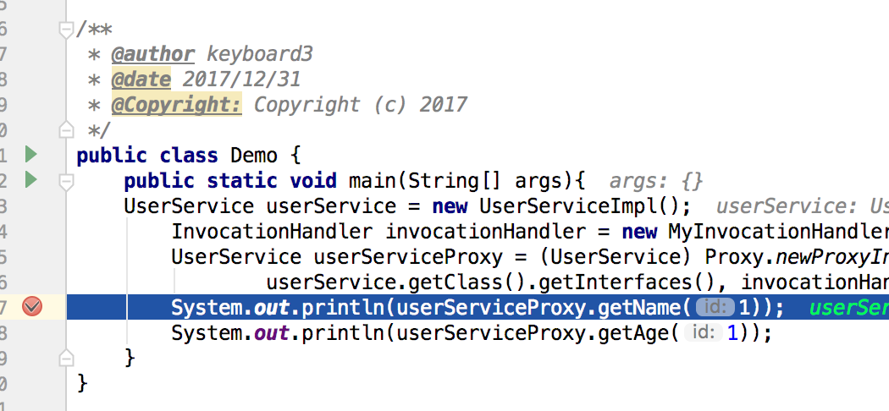
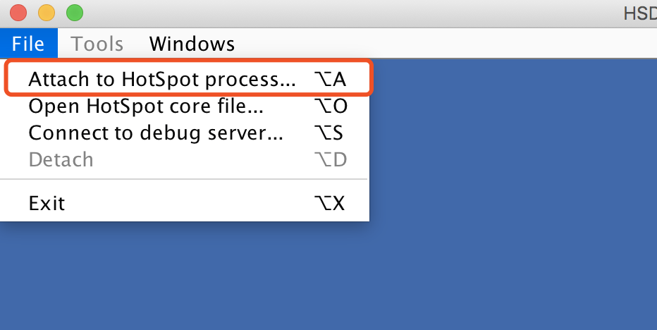
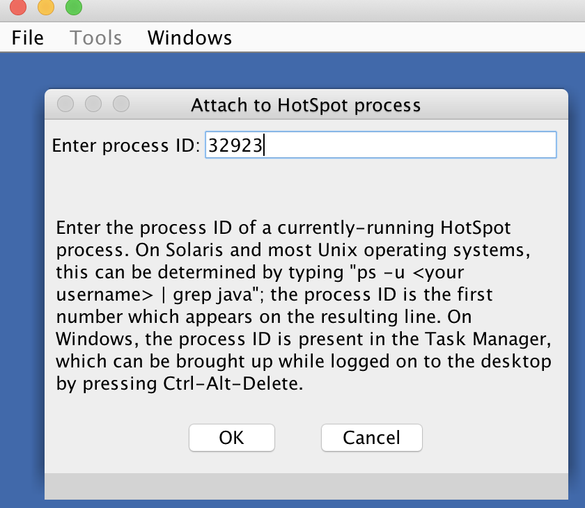
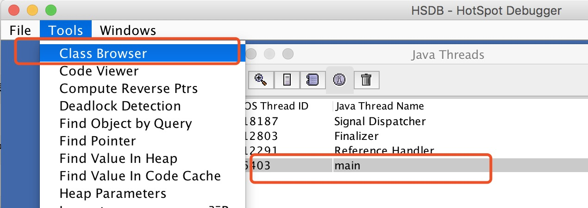
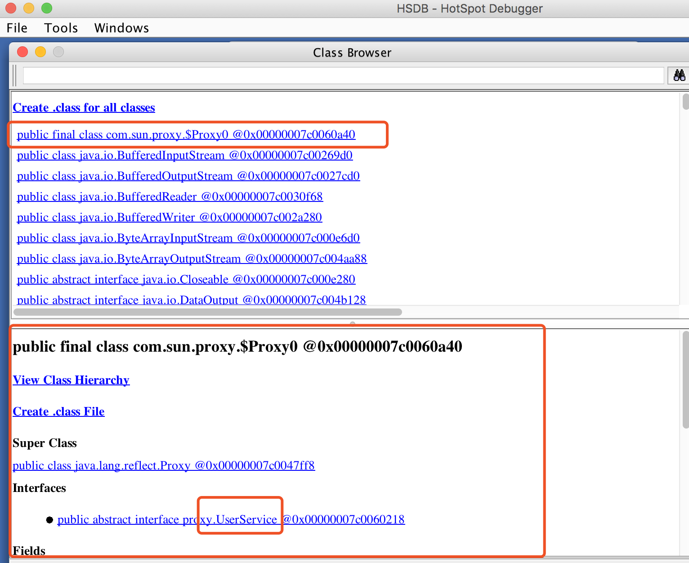
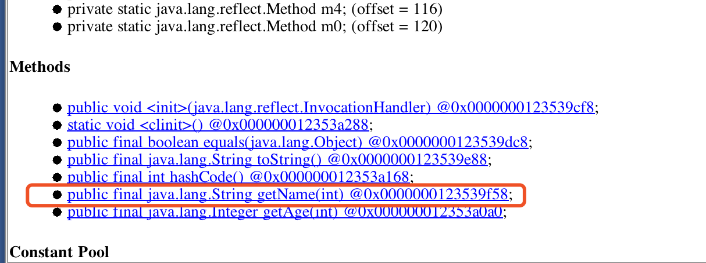
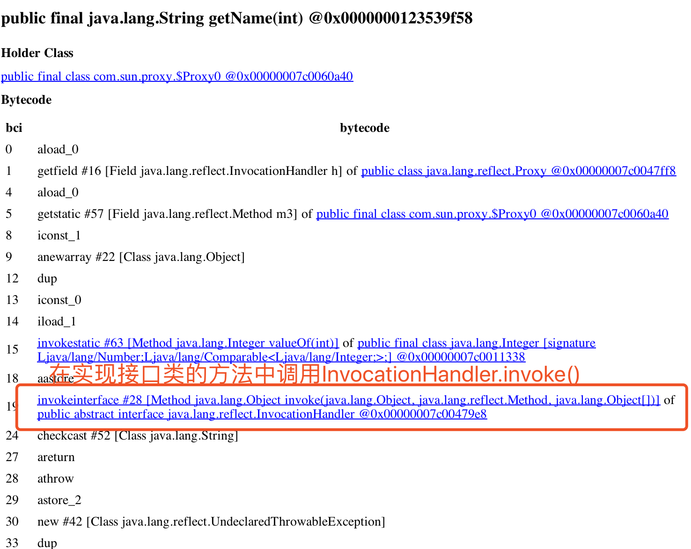

# JavaRuntimeCodeDemo
查看运行时 class 字节码

# 步骤
**给动态代理代码中打断点**
 

**在sa-jdi.jar里，还有一个图形化的工具 HSDB，也可以用来查看运行的的字节码**
 
>sudo java -classpath "$JAVA_HOME/lib/sa-jdi.jar" sun.jvm.hotspot.HSDB

**找出执行进程的 id**
 

**弹出图形化界面附加进程**
 

**查看内存中的 class**
 

**查看内存中动态代理的 $Proxy0.class**
 

**找其中UserService中的一个方法查看**
 

**可以查看到方法中会去调用InvocationHandler.invoke()方法**
 
